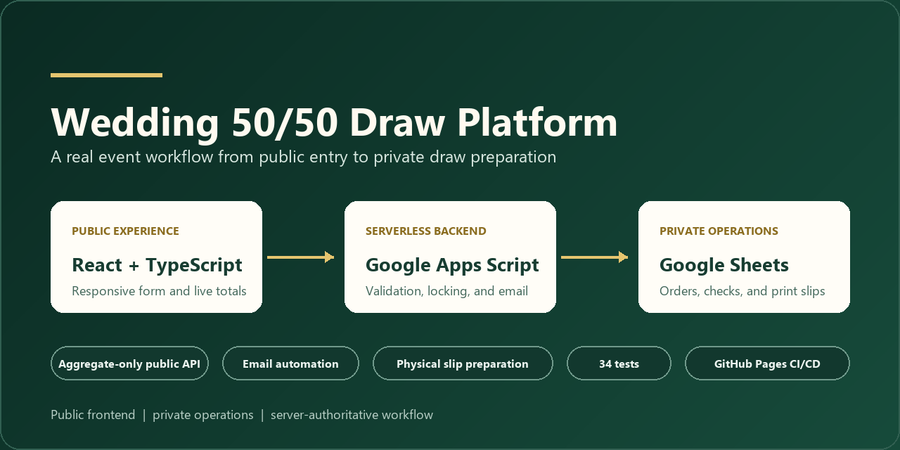
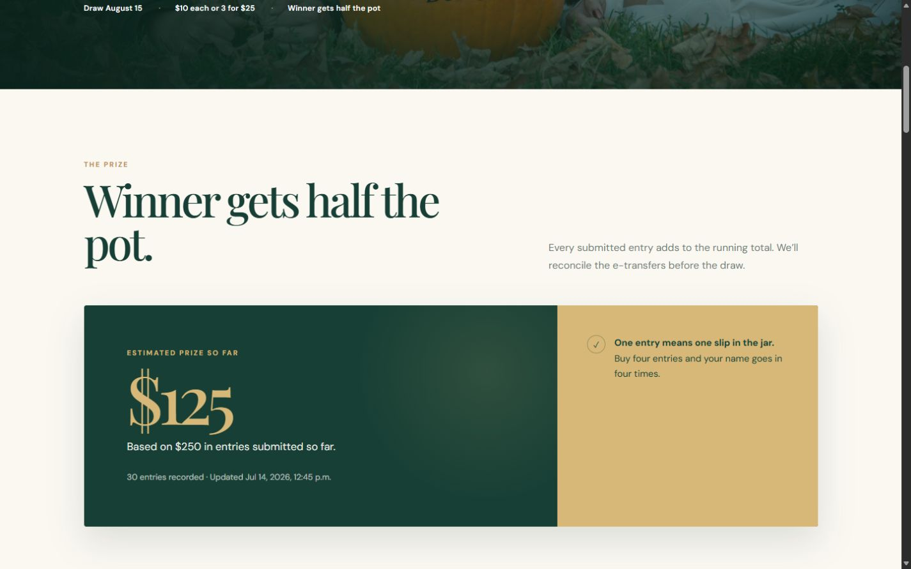
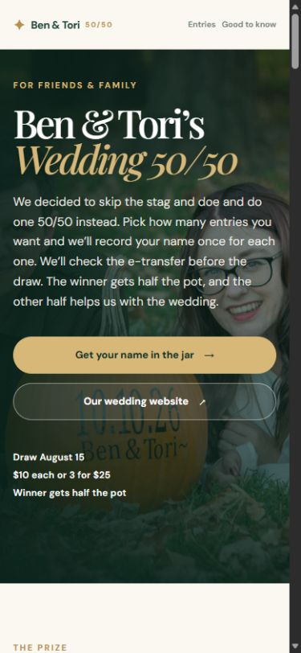
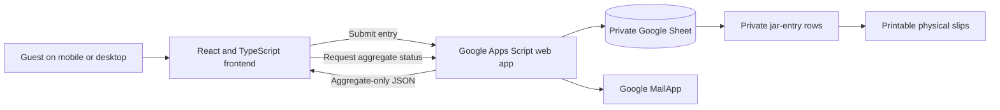

# Wedding 50/50 Draw Platform

A production React and TypeScript application that connects a public event website to a private Google Workspace operations workflow.

[](https://github.com/benthompsondev/wedding-50-50/actions/workflows/ci.yml)
[](https://github.com/benthompsondev/wedding-50-50/actions/workflows/deploy.yml)

[Live Site](https://benthompsondev.github.io/wedding-50-50/) · [Architecture](docs/architecture.md) · [Technical Decisions](docs/design-decisions.md) · [Operations Documentation](docs/operations.md)



## Overview

I built this for a real wedding fundraiser, not as a sample storefront. The public site gives friends and family a simple mobile-friendly way to choose entries, see the correct price, submit their information, receive payment instructions, and follow the live aggregate totals.

Behind that public experience is a private operational workflow. Google Apps Script validates and records submissions in Google Sheets, sends confirmation emails, updates the public totals, and prepares one printable name slip for every included entry. Payments are sent separately by e-transfer and checked manually. The application does not process money or choose the winner.

The final draw stays physical: every included entry becomes a printed slip, the slips go into a jar, and one name is drawn on video.

## Live interface

The public experience is responsive, keyboard accessible, and intentionally keeps operational records behind the private Google Sheet boundary.






## What it demonstrates

- Turning a loosely defined real-world request into a complete production workflow
- Connecting a React frontend to Google Workspace without exposing the private ledger
- Recalculating trusted prices and validating submissions on the server
- Automating email, reconciliation support, aggregate totals, and print preparation
- Designing a responsive and accessible interface for nontechnical users
- Testing frontend behavior and the Apps Script data contract
- Building and deploying through GitHub Actions and GitHub Pages
- Balancing software automation with a physical real-world process

## Architecture



Names, email addresses, phone numbers, payment checks, messages, internal IDs, and individual orders never come back through the public status endpoint. See [Architecture](docs/architecture.md) for the trust boundary and data flow.

## Key engineering decisions

- **Google Apps Script and Sheets fit the scope.** This is a one-event workflow operated by two nontechnical administrators, so a private Sheet and a small serverless backend were a practical fit without adding another hosted database or admin application.
- **The backend owns pricing.** The browser shows the price, but Apps Script recalculates it before writing anything. A changed browser request cannot choose its own total.
- **Writes are locked.** Apps Script `LockService` protects the order write and refresh sequence when submissions arrive close together.
- **Duplicate submissions are bounded.** Matching submissions inside a short window return the existing result instead of appending another row. Intentional purchases later are still allowed.
- **The form fails closed.** The live form stays unavailable until the backend returns a valid aggregate status response.
- **The public API returns aggregates only.** Live totals are useful to guests; participant records are not.
- **The draw remains physical.** The software prepares and checks the slips, but it never selects a digital winner.

The longer rationale, including the post-event demo plan and public API naming debt, is in [Technical Decisions](docs/design-decisions.md).

## Entry workflow

1. A participant chooses between 1 and 99 entries.
2. The browser calculates the visible price using the same pricing rule as the backend.
3. The participant submits their name, contact details, and e-transfer sender name.
4. Apps Script validates the request, recalculates the price, and writes an `Included` order to the private Sheet.
5. Payment instructions are emailed and the aggregate public totals refresh.
6. The e-transfer is reconciled manually with a private checkbox.
7. Cancelled or refunded entries are removed from the totals, jar rows, and printable slips.
8. Every remaining included entry becomes one physical slip for the recorded jar draw.

## Reliability and privacy

- Server-authoritative pricing and sales-cutoff checks
- Script locking around concurrent writes
- Short-window duplicate-submission protection
- Aggregate-only public status parsing
- Private Google Sheet boundary for participant and payment data
- Spreadsheet-safe text handling before values are written
- Backend readiness check before the entry form becomes available
- No card processing, analytics, trackers, or public participant ledger
- Printable-slip count checks before the draw materials are accepted

## Testing

The test suite covers the parts that would be easiest to get wrong during a live draw:

- pricing boundaries and invalid quantities
- form validation and email typo warnings
- sales cutoff and countdown behavior
- frontend and backend duplicate-submission guards
- public status parsing and aggregate-only privacy contract
- backend readiness and fail-safe form states
- successful submission and trusted response handling
- lightbox keyboard navigation and focus restoration
- legacy status migration behavior
- included, cancelled, and refunded entry handling
- jar-entry and printable-slip counts
- Apps Script manifest and public response contracts

## Technology

- React
- TypeScript
- Vite
- Google Apps Script
- Google Sheets
- Google MailApp
- Vitest
- Node.js test runner
- GitHub Actions
- GitHub Pages

## Local development

Requires Node.js 22 or newer.

```powershell
npm ci
npm test
npm run lint
npm run build
npm run dev
```

Vite uses the `/wedding-50-50/` base path so scripts, styles, images, the manifest, and the favicon work from the GitHub Pages project URL.

## Project status

This is a live one-event production application for an August 2026 draw. Production dates, payment details, the Apps Script endpoint, and the private Sheet remain active.

After the event, the plan is to disable real submissions and convert the public site to a sanitized portfolio demo with fake totals and no production payment or backend configuration. The real private Sheet will remain outside GitHub.

## Documentation

- [Architecture](docs/architecture.md)
- [Technical decisions](docs/design-decisions.md)
- [Local and backend setup](docs/setup.md)
- [Day-to-day operations](docs/operations.md)
- [Physical draw runbook](docs/draw-runbook.md)
- [Launch checklist](docs/launch-checklist.md)
- [Apps Script notes](apps-script/README.md)
