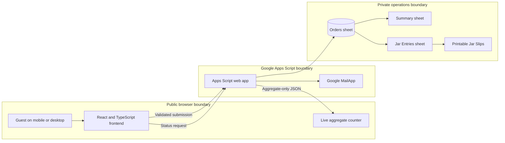

# Architecture

The application has two clear sides: a public participant experience and a private Google Workspace workflow.

## Public boundary

The browser receives the site assets and an aggregate status response. That response contains only:

- submitted entry value
- included entry count
- estimated winner prize
- included order count
- last-updated timestamp

The existing public field names are retained for compatibility during the live event. Their clearer future replacements are documented in [Technical Decisions](design-decisions.md).

## Private boundary

The private Google Sheet stores participant names, email addresses, phone numbers, e-transfer sender names, messages, payment checks, internal IDs, statuses, and timestamps. Those records are used only for reconciliation and draw preparation.

The Sheet is not linked from the site or repository. Individual order records are never returned by the public endpoint.

## Submission path

1. The browser validates the form for a quick, friendly response.
2. Apps Script validates the request again and recalculates the trusted price.
3. `LockService` protects the write and refresh sequence.
4. A matching submission inside the duplicate window returns the existing result.
5. A valid submission is added to the private Orders sheet.
6. Summary, Jar Entries, and Printable Jar Slips are rebuilt.
7. Google MailApp sends the participant their payment instructions.
8. The public counter receives only the updated aggregate totals.

## Deployment path

Pull requests and pushes to `main` run the CI workflow. Pushes to `main` also run the GitHub Pages workflow, which builds the Vite site, uploads `dist`, and deploys it without committing generated files.
